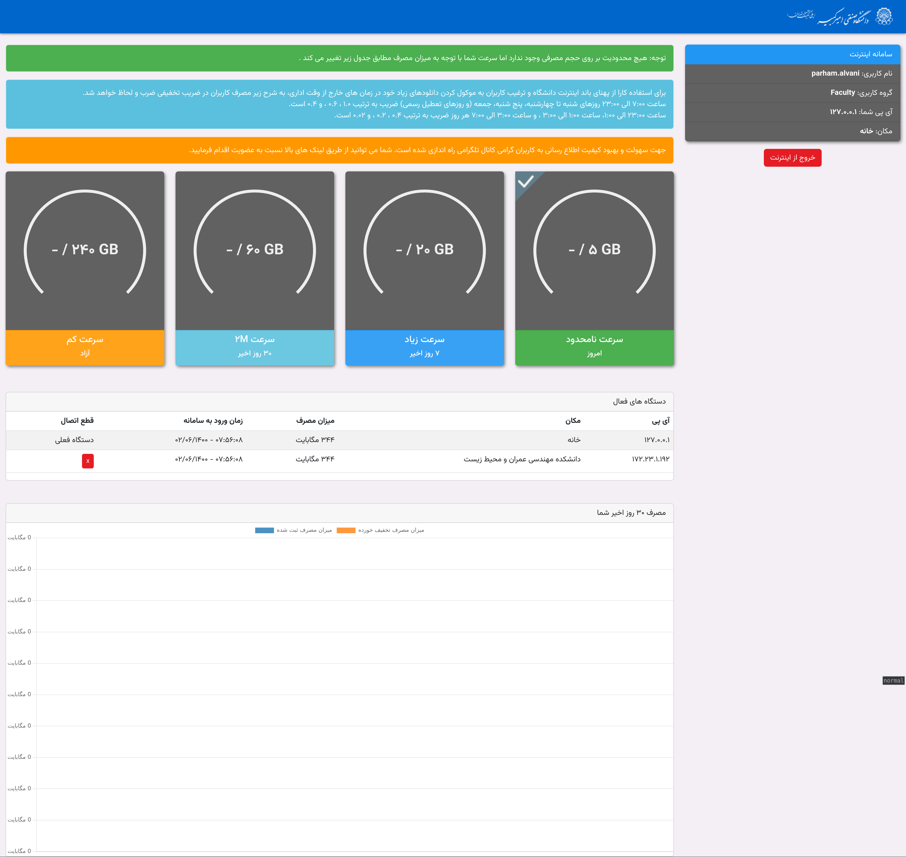
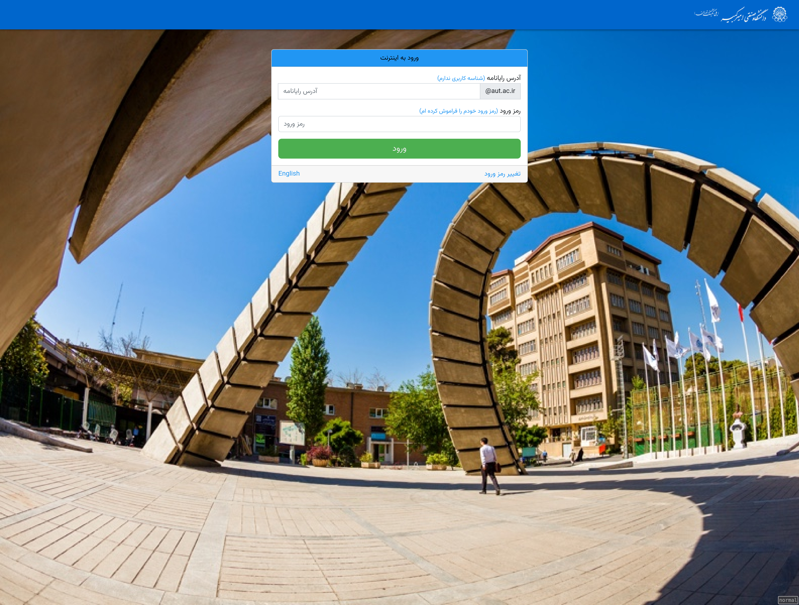

<h1 align="center">AUT Internet System</h1>

<p align="center">
  
  
  
  
</p>

## Introduction

This service with the help of a MicroTik switch and Radius server meters students internet connections.
login page which is served by this server fowards credentials to the microtik server and then uses
Radius information based on request ip address to find out about internet usage status.

## How to run locally

For testing and development this server needs a free-radius database but here I created a `migrations` folder
that contains the database migrations and automatically runs by the `docker-compose`. A user consider logged-in or out
base on his/her record in `radacct` table which is editable from the `migrations` folder. A record contains an IP
address and a logged-out date and when this logged-out time is `NULL` user consider as logged-in.

```sh
docker-compose up
cd frontend && npm run build
pipenv install
pipenv shell
python3 main.py
```

## Screenshots





